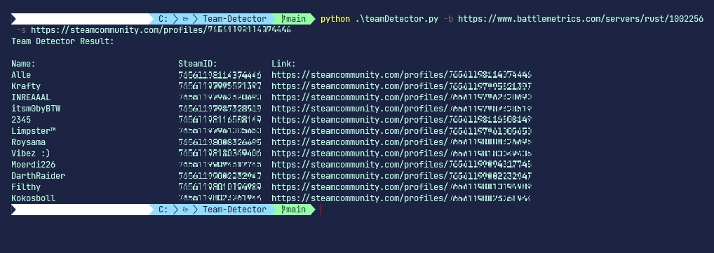
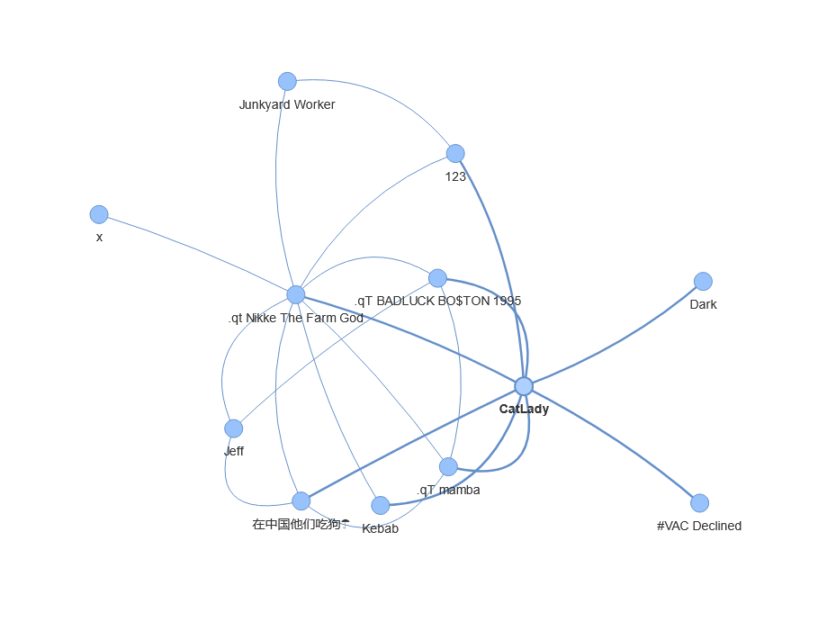

# Team-Detector
A program that detect's potential teammates on a Rust Server.

# Clone and Setup
To clone the repository:
	$ git clone https://github.com/alexemanuelol/Team-Detector.git

Install the required packages:
``` bash
$ cd Team-Detector
$ pip install -r requirements.txt
```

# Usage
You provide the program with two arguments:
- The URL to the Battlemetrics Rust Server Page (-b flag).
- The Steam Profile of the person you want to inspect (-s flag).

The program will go through the provided players friendslist and compare it with the player list on the battlemetrics page. If matches were found, it will then continue to go through the matches friendslists and continue like that till it has nowhere else to go in the search tree, i.e. All players have been searched.

When running the program, it will display the list of found potential teammates in the console, as well as open up a network visualization of who is friends with who.





You can download an windows executable from [releases](https://github.com/alexemanuelol/Team-Detector/releases) page and run the .exe file like so:

```bash
$ teamDetector.exe -b https://battlemetrics.com/servers/rust/XXXXX -s https://steamcommunity.com/profiles/XXXXXXXXXXXXXXXXX
```

# Notes
The program will only find players that are currently online on the rust server that is displayed in the battlemetrics rust server page. If the server have streamer mode on, this program won't work. Also, if you try to run the script on a person that have the friendslist private, this program won't work.