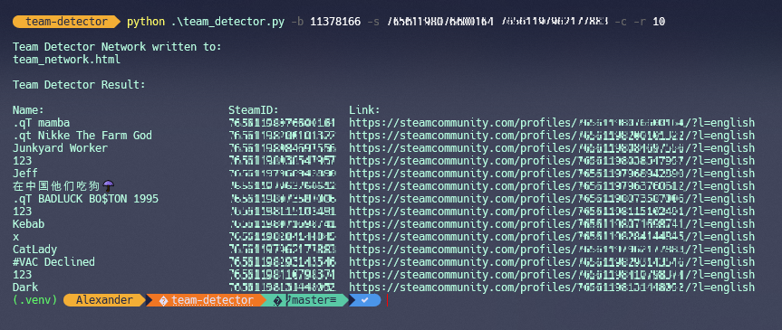

# Team-Detector
Team detection program for games on BattleMetrics and Steam. The program goes through the player list on the
BattleMetrics server page and saves all player names in an array. Then it goes through the Steam profile of the player
you want to inspect and compares the friend list names and profile comments with the BattleMetrics player array to
find out which friends are currently on the server. If the program found any matches, it will then continue to go
through the friend list of those friends and so on. What you end up with is a table of all the players that might be
part of the same team as the player you provided the Steam Profile. It will also create a .html file that visualize the
friends network to see who is friends with who etc...

# Clone and Setup
**Tested with Python version: 3.12.1**
<br>
To clone and setup the repository:
```bash
$ git clone https://github.com/alexemanuelol/team-detector.git
$ cd team-detector
$ pip install -r requirements.txt
```

# Usage

| Argument                      | Description                                                               |
|-------------------------------|---------------------------------------------------------------------------|
| -h, --help                    | Display help message.                                                     |
| -b, --battlemetrics-id ID     | BattleMetrics Server ID.                                                  |
| -s, --steam-id ID             | SteamID(s) of the person(s) you want to inspect (Separated by space).     |
| -r, --recursive-depth NUMBER  | How deep can the recursive search go? (Default 5)                         |
| -c, --comments                | Search through profile comments (Default False).                          |
| -p, --comment-pages PAGES     | The number of comment pages to go through per profile (Default 1 page).   |
| -d, --debug                   | Enables debug print (Default False).                                      |

<br>
When you run the program once, the Battlemetrics Server ID and SteamID will be saved in team_detector.json. That means that next time you want to run the program, if you don't provide the -s or -b flags, the values in the json file will be used.




You can download the windows executable from [releases](https://github.com/alexemanuelol/team-detector/releases) page and run the .exe file like so:

```bash
$ team_detector.exe -b 11378166 -s 76561198114074446
```

# Notes
The program will only find players that are currently online on the server that is displayed in the BattleMetrics Server Page. If the server have streamer mode on, this program won't work. Also, if you try to run the script on a person that have the friend list private and comments private, this program won't work.
